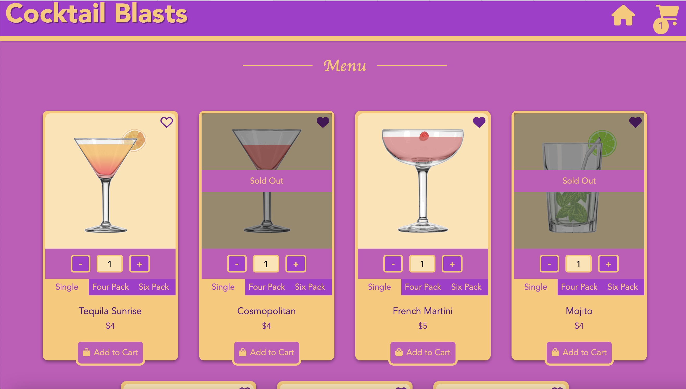
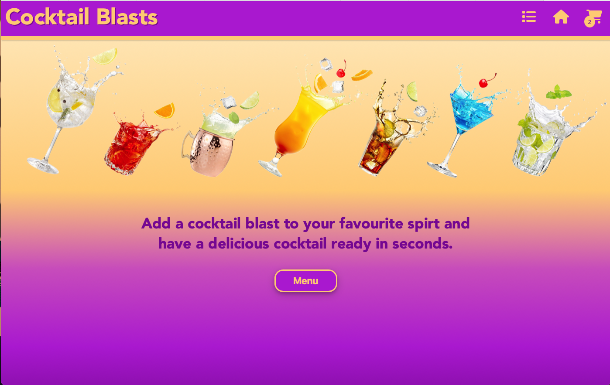
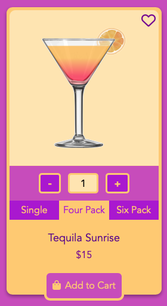
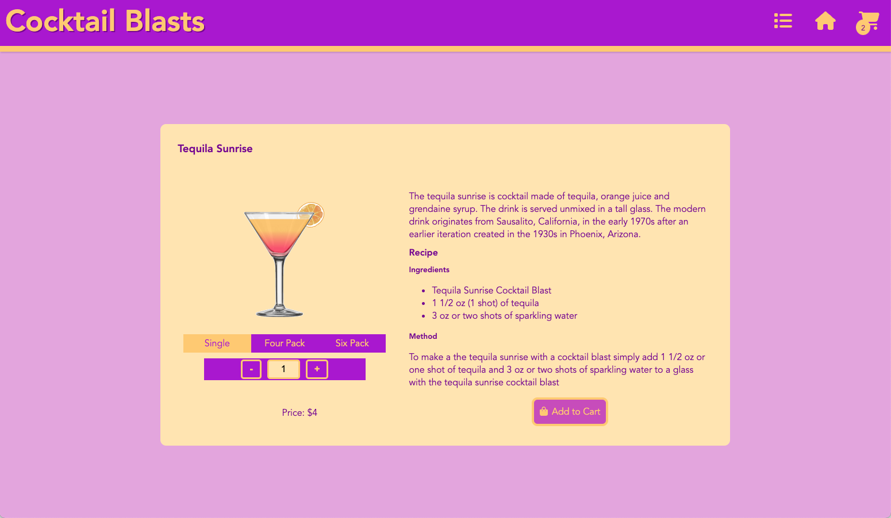
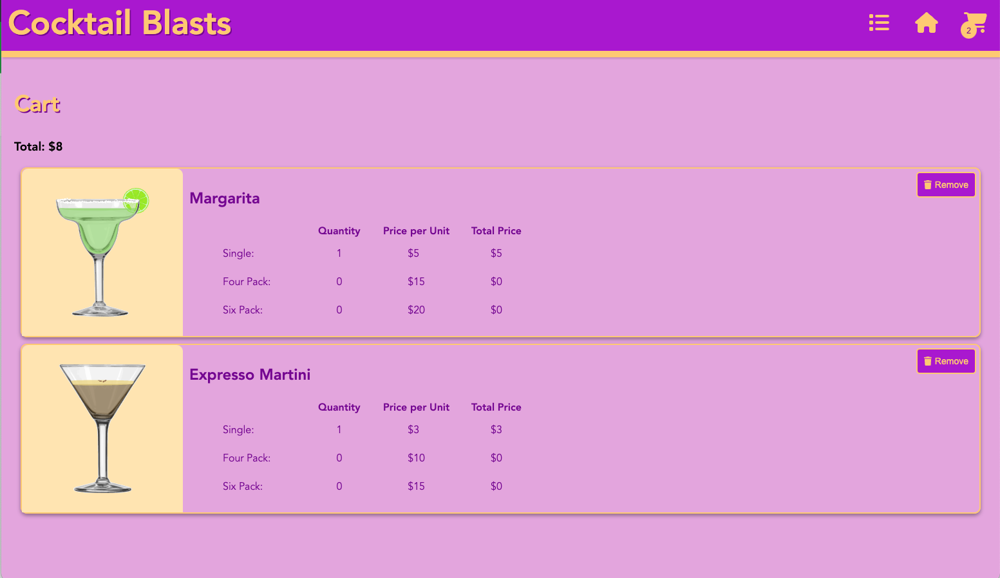

# eCommerce Site

This website is a an eStore for selling Cocktail Blasts, a solid mixer that can be combined with alcohol to help make cocktails fast. The site includes a menu page which list the range of cocktail blasts products that are available. Each product comes in three pack sizes; single, four pack and six pack. The user has the option to select the pack size they are after to view the price. When a product on the menu page is selected, a page containing more detailed infomation on the product will be displayed. Functionality for adding a product to the cart is included on the menu page and product detail page. To view items in the cart the user can navigate to the cart page via the icon in the header. Product and cart information is stored in a firebase database.

Link to hosted site: https://cocktail-blasts.web.app/#cocktailList

## Firebase

There is a singular firestore database that is being used to hold the cocktail page data. Data is stored across two collections which are detailed below.

<u>**CocktailList**</u>

This collection contains all cocktail blast products available for purshace. I added seven cocktails blasts to the database to work with. Each document contains the fields detailed below. The only field which can be modified via the webpage is the favourites field.

- **_name_**: The name of the cocktail blast flavour.
- **_favourite_**: A boolean value which is true if the user has selected the cocktail as a favourite or false if the cocktail is not a favourite.
- **_imgBlast_**: A link to an image of the cocktail that can be made with the cocktail blast. I created the images myself using boxy svg program and added them to a personal google drive to obtain an image link.
- **_imgCocktail_**: A limk to an image of the cocktail blast itself. I created the images myself using boxy svg program and added them to a personal google drive to obtain an image link.
- **_descriiption_**: A description of the cocktail that can be made with the cocktail blast.
- **_ingredients_**: An array of ingredients, as strings, which are needed for making the cocktail.
- **_recipe_**: The recipe that must be followed to make the cocktail with the cocktail blast.
- **_priceSingle_**: The price of a single cocktail blast.
- **_priceFour_**: The price of a pack of four cocktail blast.
- **_priceSix_**: The price of a pack of six cocktail blast.
- **_quantitySingle_**: The quantity of single blasts left in stock.
- **_quantityFour_**: The quantity of four pack blasts left in stock.
- **_qunatitySix_**: The quantity of six pack blasts left in stock.

<u>**Cart**</u>

The cart collection contains items that are added to the cart from the cocktail list above. The fields that should be within each document are below.

- **_name_**: The name of the cocktail blast flavour.
- **_imgBlast_**: A link to an image of the cocktail that can be made with the cocktail blast.
- **_imgCocktail_**: A link to an image of the cocktail blast itself.
- **_priceSingle_**: The price of a single cocktail blast.
- **_priceFour_**: The price of a pack of four cocktail blast.
- **_priceSix_**: The price of a pack of six cocktail blast.
- **_quantitySingle_**: The quantity of single blasts in cart.
- **_quantityFour_**: The quantity of four pack blasts left in cart.
- **_qunatitySix_**: The quantity of six pack blasts left in cart.

## Website functionality

### Home Page

The home page contains a simple backdrop with a navigation button that leads to the menu. You can also navigate to the menu by scrolling further down on the home page.

### Menu Page

The menu page contains a list of cocktail blasts which are available. There is one cocktail blast card per cocktail blast in the cocktailList collection.

<u>Cocktail Blast Card</u>

- There is an image section which includes an image of the cocktail that can be made with the cocktail blast. When you hover over the image section of the card the image changes to one of the cocktail blast itself. The image section is a reuseable component.
- There is a quantity selector where the user can select how many items they wish to add to the cart. The quantity will reference the pack size which is highlighted. Again the quanitity selector is a reusable component.
- The three pack sizes will be displayed, the selected pack size will be highlighted yellow.
- The name of the cocktail will be listed.
- The price of the selected pack size will be displayed.
- An add to cart button will allow you to add the cocktail to the cart. Once an item has been added to the cart the button will change colour and the text will display added. The add to cart button is a reusable component
- There is a heart icon in the corner of the card displaying if the cocktail is a favourite. If the icon is solid, this indicates that the product is a favourite. If the icon is outlined only it indicates the procduct is not a favourite. The favourite status of a cocktail can be changed by the user by selecting the icon.

If the quantity in stock of the selected pack is 0 a banner reading 'Sold Out' will display over the cocktail card.
If the user increases the quantity past the stock available for that product a message will display saying how many items of that product can be added to the cart.

### Cocktail Blast Details Page

When a product on the menu page is selected, a page containing more detailed infomation on the product will be displayed.

- This page includes a discription of the cocktail and the recipe for making the cocktail with the cocktail blast.
- In addition there are a number of components that are reused from the cocktail card including the quantity selector, pack size selectior and add to cart button.

### Cart Page

When the cart icon in the header is selected the user is navigated to the cart page. This shows the items that have been added to the cart. The total price of all items in the cart is at the top of the page. There is a remove button next to each cocktail blast to remove the items from the cart.

